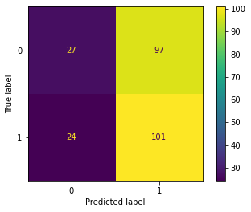
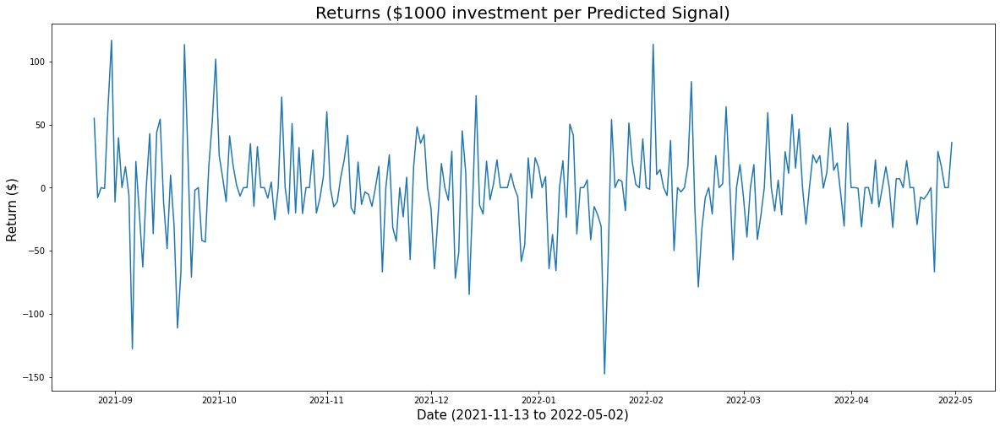
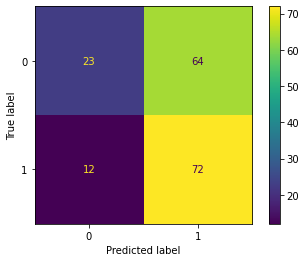
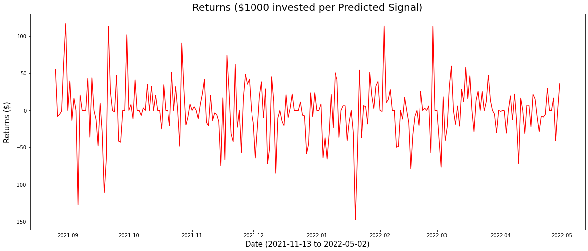

# Ethereum Price Signals

## How To Navigate Through the Repo
In the data folder, you'll find the data we used in our analysis.

In the notebooks folder, you'll find 5 notebooks. The twitter_data_collection.ipynb showcases how we scraped tweets from the top 100 users in crypto twitter. The eth_data_engineering_eda.ipynb notebook showcases our ethereum data collection as well as some exploratory data anaylysis and feature engineering. In the nlp_preprocessing.ipynb, you'll see the process we used to clean and preprocess our tweets dataset. In the topic_modeling.ipynb notebook, you'll see how we used unsupervised learning to categorize over 1 million tweets. Finally, in the model_testing_and_evals.ipynb notebook, you'll see our model creations, testing, and conclusions. 

## Overview
This project analyzes the data from Twitter about cryptocurrency sentiment and the trading data from Yahoo Finance. Base on the dataset, we are using machine learning models to determine the purchase of Ethereum in the future.

## Business Problem
The cryptocurrencies have been on the rise worldwide since 2020. The global market cap at the moment is measured at $1.4 trillion. Ethereum makes up about 20% of the market. 
J.P. Morgan Chase is looking to expand crypto footprint, and we are suggesting to invest in Ethereum. 

Our model's purpose is to classfy the purchase decision to buy or not by each day. So the company can capitalize on their Ethereum investment.

## Data Understanding
From Tweeter, we scraped all Tweets from top 100 crypto users (`crypto_tweets.csv`). The time period that we selected was from Jan 1, 2020 to May 1, 2022. 

We also gathered Ethereum data (`eth_data.csv`) from Yahoo Finance, which has daily price info along with volume for the same time period.

## Methods
This project uses NLP models, Time Series, and ML models to predict suggestions for future Ethereum purchasing decisions. The first model uses the NLP to analyze topics from over one million Tweets. The second model uses only the financial metrics as the predictors to perform. Our final model combines both the daily sentiment analysis and the financial metrics.

Model with Tweet analysis: 52% Accuracy
Returns($1000 investment per Predicted Signal): 75¢ per day

Model with financial metrics: 55.6% Accuracy
Returns($1000 investment per Predicted Signal): $2.28 per day

Model combined: 51% Accuracy
Returns($1000 investment per Predicted Signal): -0.30¢ per day

## Conclusions
Our financial metrics model yields the best result. Contrary to our initial belief, combining both the sentiment and financial data does not yield a good model.

## Next Step
Futher analyses could yield additional insights to improve to our prediction models:

- Better sampling of crypto tweets would lead to better topic modeling
- Different time variations:
    - Long Term: 1 month, 1 week charts
    - Short Term: 1 hour, 30 min charts
- Combining different sources of crypto sentiment (Telegram, Instagram, ...etc)
- Testing other technical strategies
